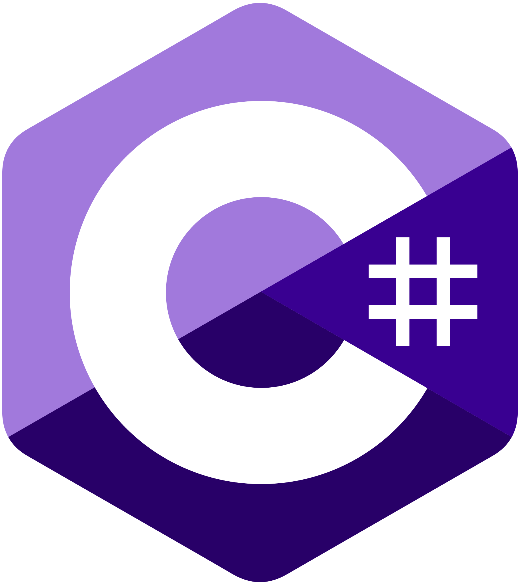

# Undergrad_Projects
 Projects I have worked on while attending Wayne State College.

Below are some notes of things I have learned while working on these projects. I will be adding more as I go along.

<!--
TO DO:

Libraries
Add more console IO examples
Block Statements
Loops
Classes
Structs
Add exception/error handling
Add exception handling to file IO
Look at Prog. I file IO examples

-->

## Outline

- [Undergrad\_Projects](#undergrad_projects)
	- [Outline](#outline)
		- [BASICS](#basics)
			- [Get Started](#get-started)
			- [Comments](#comments)
			- [Console IO](#console-io)
			- [Conditional Statements](#conditional-statements)
			- [Loops](#loops)
			- [Arrays \& Vectors](#arrays--vectors)
			- [Structures](#structures)
			- [References](#references)
			- [Pointers](#pointers)
		- [FUNCTIONS](#functions)
		- [CLASSES](#classes)
		- [EXCEPTIONS](#exceptions)
		- [FILE IO](#file-io)
			- [Create a File](#create-a-file)
			- [Overwrite a File](#overwrite-a-file)
			- [Append Text to a File](#append-text-to-a-file)
			- [Read From a File](#read-from-a-file)
		- [BASICS](#basics-1)
			- [Get Started](#get-started-1)
			- [Comments](#comments-1)
			- [Console IO](#console-io-1)
		- [ERROR HANDLING](#error-handling)
		- [FILE IO](#file-io-1)
			- [Create a File](#create-a-file-1)
			- [Overwrite a File](#overwrite-a-file-1)
			- [Append Text to a File](#append-text-to-a-file-1)
			- [Read From a File](#read-from-a-file-1)
		- [BASICS](#basics-2)
			- [Get Started](#get-started-2)
			- [Comments](#comments-2)
			- [Console IO](#console-io-2)
		- [CLASSES](#classes-1)
		- [EXCEPTIONS](#exceptions-1)
		- [FILE IO](#file-io-2)
		- [BASICS](#basics-3)
			- [Get Started](#get-started-3)
			- [Comments](#comments-3)
			- [Console IO](#console-io-3)
		- [CLASSES](#classes-2)
		- [EXCEPTIONS](#exceptions-2)
		- [FILE IO](#file-io-3)
			- [Create a File](#create-a-file-2)
			- [Overwrite a File](#overwrite-a-file-2)
			- [Append Text to a File](#append-text-to-a-file-2)
			- [Read From a File](#read-from-a-file-2)
			- [Get File Information](#get-file-information)
			- [Delete a File](#delete-a-file)
			- [Delete a Folder](#delete-a-folder)
		- [BASICS](#basics-4)
			- [Get Started](#get-started-4)
			- [Comments](#comments-4)
			- [Console IO](#console-io-4)
		- [CLASSES](#classes-3)
		- [EXCEPTIONS](#exceptions-3)
		- [FILE IO](#file-io-4)
			- [Create a File](#create-a-file-3)
			- [Overwrite a File](#overwrite-a-file-3)
			- [Append Text to a File](#append-text-to-a-file-3)
			- [Read From a File](#read-from-a-file-3)
			- [Delete a File](#delete-a-file-1)
			- [Delete a Folder](#delete-a-folder-1)
		- [BASICS](#basics-5)

<!--
- [HTML](#html)
  - [Basics](#html-basics)
- [CSS](#css)
  - [Basics](#css-basics)
- [Javascript](#javascript)
  - [Basics](#javascript-basics)
- [Typescript](#typescript)
  - [Basics](#typescript-basics)
- [PyScript](#pyscript
  - [Basics](#pyscript-basics)
-->

---

<p align="center" name="cpp">
    
</p>

### <a name="cpp-basics"><ins>BASICS</ins></a>

Check out [W3 Schools][W3Schools.CPP] to learn some of the basics of C++. They have many examples and cover just about everything you need to get started.

#### <a name="cpp-get-started">Get Started</a>

```cpp

#include <iostream>
using namespace std;

int main() {
	cout << "Hello World!";
	return 0;
}

```

#### <a name="cpp-comments">Comments</a>

```cpp

// Single-line comments

/*
Multi-line comments
*/

```

#### <a name="cpp-console-io">Console IO</a>

```cpp

string example = "?";

cin >> example;
cout << "This is what you entered: " << example;

```

#### <a name="cpp-conditional">Conditional Statements</a>

If, else if, and else statements can be great when you want to set different paths for the program to take.

```cpp

int x = 2;

if (x >= 3) {
	cout << "Greater than or equal to 3" << endl;
}
else if (x <= 1) {
	cout << "Less than or equal to 1" << endl;
}
else {
	cout << "The number is 2" << endl;
}

```

Ternary Operaters are shorter than if statements, but can be harder to read.

```cpp

int x = 2;

string result = (x >= 3) ? "Greater than or equal to 3\n" : "Less than 3\n";

```

Switch statements are great when you have multiple expressions based on one variable.

```cpp

int day = 5;

switch (day) {
	case 1:
		cout << "Monday";
		break;
	case 2:
		cout << "Tuesday";
		break;
	case 3:
		cout << "Wednesday";
		break;
	case 4:
		cout << "Thursday";
		break;
	case 5:
		cout << "Friday";
		break;
	default:
		cout << "Must be an integer 1-5.\n";
		break;

```

#### <a name="cpp-loops">Loops</a>

While loops are great when you don't know how many times you want the loop to run.

```cpp

bool continueLoop = true;
string input = "?";

while (continueLoop) {
	cout << "Would you like to continue? ";
	cin >> input;
	
	if (input == "no") {
		continueLoop = false;
	}
}

```

Do While loops are great when you want the loop to check the condition at the end of the loop. Instead of ending right once the condition is met, the loop will run before ending.

```cpp

int i = 0;

do {
	cout << i << endl;
	i++;
	
	if (i == 5) {
		cout << "Loop done";
	}
}
while (i < 5);

```

For loops are great when you know how many times you want the loop to run. They are also great when working with vectors and arrays.

```cpp

for (int i = 0; i < 8; i++) {
	cout << i << endl;
}

```

Break and Continue can be used to go back to the start of a loop or to exit the loop.

```cpp

for (int i = 1; i <= 2; i++) {
	cout << i << endl;

	for (int j = 10; j <=13; j++) {
		cout << j << endl;

		if (i == 2 && j == 12) {
			cout << "Break\n";
			break;
		}
		if (i == 2) {
			cout << "Continue\n";
			continue;
		}

		cout << "End of j loop\n";
	}
	cout << "End of i loop\n";
}
cout << "Program done\n";

```

#### <a name="cpp-arrays-vectors">Arrays & Vectors</a>

```cpp

cout << "Arrays & Vectors";

```

#### <a name="cpp-structs">Structures</a>

```cpp

cout << "Structures";

```

#### <a name="cpp-references">References</a>

```cpp

cout << "References";

```

#### <a name="cpp-pointers">Pointers</a>

```cpp

cout << "Pointers";

```

### <a name="cpp-functions"><ins>FUNCTIONS</ins></a>

```cpp

cout << "Functions";

```

### <a name="cpp-classes"><ins>CLASSES</ins></a>

```cpp

cout << "Classes";

```

### <a name="cpp-exceptions"><ins>EXCEPTIONS</ins></a>

You can use throw to output a reference number.

```cpp

// Block of code to try
try {
	int age = 15;
	if (age >= 18) {
		cout << "Access granted - you are old enough.";
	}
	else {
		// Throw an exception when a problem arises
		throw 505;
	}
}
// Block of code to handle errors
catch (int myNum) {
	cout << "Access denied - You must be at least 18 years old.\n";
	cout << "Error number: " << myNum;
}

```

You can also use "..." in the catch if you don't know the throw type.

```cpp

// Block of code to try
try {
	int age = 15;
	if (age >= 18) {
		cout << "Access granted - you are old enough.";
	}
	else {
		// Throw an exception when a problem arises
		throw 505;
	}
}
// Block of code to handle errors
catch (...) {
	cout << "Access denied - You must be at least 18 years old.\n";
}

```

### <a name="cpp-file-io"><ins>FILE IO</ins></a>

Its best to close a file once you're done working with it.

#### <a name="cpp-create-file">Create a File</a>

```cpp

// Create a text file
ofstream {"filename.txt"};

```

#### <a name="cpp-write-file">Overwrite a File</a>

```cpp

// Create file object
ofstream MyFile;

// Open a text file
MyFile.open("filename.txt");

// Write to the file
MyFile << "Test write" << endl;

// Close the file
MyFile.close();

```

#### <a name="cpp-append-file">Append Text to a File</a>

```cpp

// Create file object
ofstream MyFile;

// Open a text file using append instead of overwrite
MyFile.open("filename.txt", ios::app);

// Write to the file
MyFile << "Test write" << endl;

// Close the file
MyFile.close();

```

#### <a name="cpp-read-file">Read From a File</a>

```cpp

// Create a text string, which is used to output the text file
string myText;

// Read from the text file
ifstream MyFile("filename.txt");

// Use a while loop together with the getline() function to read the file line by line
while (getline(MyFile, myText)) {
	// Output the text from the file
	cout << myText;
}

// Close the file
MyFile.close();

```

[Back to Outline](#Outline)

---

<p align="center" name="c">
    
</p>

### <a name="c-basics"><ins>BASICS</ins></a>

Check out [W3 Schools][W3Schools.C] to learn some of the basics of C. They have many examples and cover just about everything you need to get started.

#### <a name="c-get-started">Get Started</a>

```c

#include <stdio.h>

int main() {
	printf("Hello World!");
	return 0;
}

```

#### <a name="c-comments">Comments</a>

```c

// Single-line comments

/*
Multi-line comments
*/

```

#### <a name="c-console-io">Console IO</a>

```c

char example[30];

scanf("%s", example);
printf("This is what you entered: %s", example);

```

This will read past spaces.

```c

char example[30];

fgets(example, sizeof(example), stdin);
printf("This is what you entered: %s", example);

// Could also use puts
puts(example);

```

### <a name="c-error-handling"><ins>ERROR HANDLING</ins></a>

```c

printf("Error Handling");

```

### <a name="c-file-io"><ins>FILE IO</ins></a>

Its best to close a file once you're done working with it. You can find more file modes and information [here][C.Files.Programiz].

#### <a name="c-create-file">Create a File</a>

```c

// Create pointer of FILE type
FILE *fptr;

// Use appropriate location, w for write mode
fptr = fopen("C:\\filename.txt","w");

fclose(fptr);

```

#### <a name="c-write-file">Overwrite a File</a>

```c

// Create pointer of FILE type
FILE *fptr;

// Use appropriate location, w for write mode
fptr = fopen("C:\\filename.txt","w");

if(fptr == NULL) {
	printf("Error!");   
	exit(1);             
}

fprintf(fptr,"Test write\n");
fclose(fptr);

```

#### <a name="c-append-file">Append Text to a File</a>

```c

// Create pointer of FILE type
FILE *fptr;

// Use appropriate location, a for append mode
fptr = fopen("C:\\filename.txt","a");

if(fptr == NULL) {
	printf("Error!");   
	exit(1);             
}

fprintf(fptr,"Test write\n");
fclose(fptr);

```

#### <a name="c-read-file">Read From a File</a>

```c

// Create pointer of FILE type
FILE *fptr;
char fileText[30];

// Use appropriate location, r for read mode
if ((fptr = fopen("C:\\name.txt","r")) == NULL){
	printf("Error! opening file");

	// Program exits if the file pointer returns NULL.
	exit(1);
}

while(fgets(fileText, 30, fptr)) {
	printf("%s", fileText);
}

fclose(fptr);

```

[Back to Outline](#Outline)

---

<p align="center" name="c-sharp">
    
</p>

### <a name="cs-basics"><ins>BASICS</ins></a>

Check out [W3 Schools][W3Schools.C-Sharp] to learn some of the basics of C#. They have many examples and cover just about everything you need to get started.

#### <a name="cs-get-started">Get Started</a>

```cs

using System;

class Program {
	static void Main(string[] args) {
		Console.WriteLine("Hello World!");    
	}
}

```

#### <a name="cs-comments">Comments</a>

You can find more information on documentation style comments [here][C-Sharp.Docs].

```cs

// Single-line comments

/*
Multi-line comments
*/

/// <summary>
/// Documentation style comments
/// </summary>

```

#### <a name="cs-console-io">Console IO</a>

```cs

string example = Console.ReadLine();
Console.WriteLine("This is what you entered: " + example);

```

### <a name="cs-classes"><ins>CLASSES</ins></a>

```cs

Console.WriteLine("Classes");

```

### <a name="cs-exceptions"><ins>EXCEPTIONS</ins></a>

```cs

Console.WriteLine("Exceptions");

```

### <a name="cs-file-io"><ins>FILE IO</ins></a>

Its best to close a file once you're done working with it.

```cs

Console.WriteLine("File IO");

```

[Back to Outline](#Outline)

---

<p align="center" name="java">
    
</p>

### <a name="java-basics"><ins>BASICS</ins></a>

Check out [W3 Schools][W3Schools.Java] to learn some of the basics of Java. They have many examples and cover just about everything you need to get started.

#### <a name="java-get-started">Get Started</a>

The class must have the same name as the java file.

```java

public class Main {
	public static void main(String[] args) {
		System.out.println("Hello World!");
	}
}

```

#### <a name="java-comments">Comments</a>

```java

// Single-line comments

/*
Multi-line comments
*/

/**
 * Javadoc documentation style comment
 */


```

#### <a name="java-console-io">Console IO</a>

```java

Scanner scan = new Scanner(System.in);

String example = scan.nextLine();
System.out.println("This is what you entered: " + example);

```

### <a name="java-classes"><ins>CLASSES</ins></a>

```java

System.out.println("Classes");

```

### <a name="java-exceptions"><ins>EXCEPTIONS</ins></a>

```java

// Block of code to try
try {
	int[] myNumbers = {1, 2, 3};
	System.out.println(myNumbers[10]);
}
// Block of code to handle errors
catch (Exception e) {
	System.out.println("Something went wrong.");
}

```

The finally block will be executed either way.

```java

// Block of code to try
try {
	int[] myNumbers = {1, 2, 3};
	System.out.println(myNumbers[10]);
}
// Block of code to handle errors
catch (Exception e) {
	System.out.println("Something went wrong.");
}
// Block of code to be executed either way
finally {
	System.out.println("The 'try catch' is finished.");
}

```

Throw can be used to specify the exception type.

```java

int age = 17;
	  
if (age < 18) {
	throw new ArithmeticException("Access denied - You must be at least 18 years old.");
}
else {
	System.out.println("Access granted - You are old enough!");
}

```

### <a name="java-file-io"><ins>FILE IO</ins></a>

Its best to close a file once you're done working with it.

#### <a name="java-create-file">Create a File</a>

```java

try {
	File myFile = new File("filename.txt");

	if (myFile.createNewFile()) {
		System.out.println("File created: " + myFile.getName());
	}
	else {
		System.out.println("File already exists.");
	}
}
catch (IOException e) {
	System.out.println("An error occurred.");
	e.printStackTrace();
}

```

#### <a name="java-write-file">Overwrite a File</a>

```java

try {
	FileWriter myWriter = new FileWriter("filename.txt");
  
	myWriter.write("Test write\n");
	myWriter.close();
	System.out.println("Successfully wrote to the file.");
}
catch (IOException e) {
	System.out.println("An error occurred.");
	e.printStackTrace();
}

```

#### <a name="java-append-file">Append Text to a File</a>

To append text, just pass "true" in FileWriter's constructor.

```java

try {
	FileWriter myWriter = new FileWriter("filename.txt", true);

	myWriter.write("Test write\n");
	myWriter.close();
	System.out.println("Successfully wrote to the file.");
}
catch (IOException e) {
	System.out.println("An error occurred.");
	e.printStackTrace();
}

```

#### <a name="java-read-file">Read From a File</a>

```java

try {
	File myFile = new File("filename.txt");
	Scanner scan = new Scanner(myFile);
  
	while (scan.hasNextLine()) {
		String data = scan.nextLine();
		System.out.println(data);
	}
	scan.close();
}
catch (FileNotFoundException e) {
	System.out.println("An error occurred.");
	e.printStackTrace();
}

```

#### <a name="java-info-file">Get File Information</a>

```java

File myFile = new File("filename.txt");
	  
if (myFile.exists()) {
	System.out.println("File name: " + myFile.getName());
	System.out.println("Absolute path: " + myFile.getAbsolutePath());
	System.out.println("Writeable: " + myFile.canWrite());
	System.out.println("Readable " + myFile.canRead());
	System.out.println("File size in bytes " + myFile.length());
}
else {
	System.out.println("The file does not exist.");
}

```

#### <a name="java-delete-file">Delete a File</a>

```java

File myFile = new File("filename.txt");

if (myFile.delete()) {
	System.out.println("Deleted the file: " + myFile.getName());
}
else {
	System.out.println("Failed to delete the file.");
}

```

#### <a name="java-delete-folder">Delete a Folder</a>

```java

File myFolder = new File("C:\\Users\\MyName\\Test");

if (myFolder.delete()) { 
	System.out.println("Deleted the folder: " + myFolder.getName());
}
else {
	System.out.println("Failed to delete the folder.");
}

```

[Back to Outline](#Outline)

---

<p align="center" name="python">
    
</p>

### <a name="py-basics"><ins>BASICS</ins></a>

Check out [W3 Schools][W3Schools.Python] to learn some of the basics of Python. They have many examples and cover just about everything you need to get started.

Python uses new lines to complete commands, unlike how other languages often use semicolons. Python also relies on indentation instead of curly-brackets like many other languages use.

#### <a name="py-get-started">Get Started</a>

You can start like this.

```python

print("Hello World!")

```

Or you can start with a main. This is better if being imported.

```python

def main():
	print("Hello World!")

if __name__ == "__main__":
	main()

```

#### <a name="py-comments">Comments</a>

```python

#Single-line comments

'''
Multi-line comments
'''

"""Single-line Docstring documentation style comments"""

'''
Also used for multi-line Docstring documentation style comments
'''

```

#### <a name="py-console-io">Console IO</a>

```python

example = input("Enter anything:")
print("This is what you entered: " + example)

```

### <a name="py-classes"><ins>CLASSES</ins></a>

```python

print("Classes")

```

### <a name="py-exceptions"><ins>EXCEPTIONS</ins></a>

You can specify a block for a certain type of error.

```python

try:
	print(x)
except NameError:
	print("Variable x is not defined")
except:
	print("Something else went wrong")

```

You can use an else, which will be executed if there are no errors.

```python

try:
	print("Hello")
except:
	print("Something went wrong")
else:
	print("Nothing went wrong")

```

You can uses finally, which will be executed either way.

```python

try:
	print(x)
except:
	print("Something went wrong")
finally:
	print("The 'try except' is finished")

```

You can use raise to throw an exception if a condition occurs.

```python

x = -1

if x < 0:
	raise Exception("Sorry, no numbers below zero")

```

You can specify what type of error as well.

```python

x = "hello"

if not type(x) is int:
	raise TypeError("Only integers are allowed")

```

### <a name="py-file-io"><ins>FILE IO</ins></a>

Its best to close a file once you're done working with it.

#### <a name="py-create-file">Create a File</a>

This will return an error if the file exists.

```python

#The "x" specifies to create the file
myFile = open("filename.txt", "x")
myFile.close()

```

#### <a name="py-write-file">Overwrite a File</a>

This can also be used to create a file and will overwrite the contents of the file.

```python

#The "w" specifies to overwrite the file
myFile = open("filename.txt", "w")
myFile.write("Test write\n")
myFile.close()

```

#### <a name="py-append-file">Append Text to a File</a>

This can also be used to create a file and will append to the file.

```python

#The "a" specifies to append to the file
myFile = open("filename.txt", "a")
myFile.write("Test write\n")
myFile.close()

```

#### <a name="py-read-file">Read From a File</a>

This will read everything from the file, but you can pass an integer to specify how many characters you want to read.

```python

#The "r" specifies to read from the file
myFile = open("filename.txt", "r")
print(myFile.read())
#print(myFile.read(5))
myFile.close()

```

You can also read line-by-line with the two examples below.

```python

#The "r" specifies to read from the file
myFile = open("filename.txt", "r")
print(myFile.readline())
myFile.close()

```

```python

#The "r" specifies to read from the file
myFile = open("filename.txt", "r")
for x in myFile:
	print(x)
myFile.close()

```

#### <a name="py-delete-file">Delete a File</a>

It is best to check if the file exists to avoid an error.

```python

import os
if os.path.exists("filename.txt"):
	os.remove("filename.txt")
else:
	print("The file does not exist")

```

#### <a name="py-delete-folder">Delete a Folder</a>

```python

import os
os.rmdir("myfolder")

```

[Back to Outline](#Outline)

---

<p align="center" name="markdown">
    
</p>

### <a name="markdown-basics"><ins>BASICS</ins></a>

Check out [this YouTube tutorial](https://youtu.be/pTCROLZLhDM) to learn some of the basics of Markdown. This video will walk you through a worksheet to help you get started.

Check out [this markdown file](Markdown-Worksheet.md) to see some of the basics for GitHub.

[Back to Outline](#Outline)

<!--
---

## HTML

### <a name="html-basics">Basics</a>

Check out [W3 Schools][W3Schools.HTML] to learn some of the basics of HTML. They have many examples and cover just about everything you need to get started.

[Back to Outline](#Outline)

---

## CSS

### <a name="css-basics">Basics</a>

Check out [W3 Schools][W3Schools.CSS] to learn some of the basics of CSS. They have many examples and cover just about everything you need to get started.

[Back to Outline](#Outline)

---

## Javascript

### <a name="javascript-basics">Basics</a>

Check out [W3 Schools][W3Schools.Javascript] to learn some of the basics of Javascript. They have many examples and cover just about everything you need to get started.

[Back to Outline](#Outline)

---

## Typescript

### <a name="typescript-basics">Basics</a>

Check out [W3 Schools][W3Schools.Typescript] to learn some of the basics of Typescript. They have many examples and cover just about everything you need to get started.

[Back to Outline](#Outline)

---

## PyScript

### <a name="pyscript-basics">Basics</a>

Check out _Redacted_ to learn some of the basics of PyScript. They have many examples and cover just about everything you need to get started.

[Back to Outline](#Outline)
-->

[W3Schools.CPP]: https://www.w3schools.com/cpp/default.asp
[W3Schools.C]: https://www.w3schools.com/c/index.php
[W3Schools.C-Sharp]: https://www.w3schools.com/cs/index.php
[W3Schools.Java]: https://www.w3schools.com/java/default.asp
[W3Schools.Python]: https://www.w3schools.com/python/default.asp
[W3Schools.HTML]: https://www.w3schools.com/html/default.asp
[W3Schools.CSS]: https://www.w3schools.com/css/default.asp
[W3Schools.Javascript]: https://www.w3schools.com/js/default.asp
[W3Schools.Typescript]: https://www.w3schools.com/typescript/index.php

[C.Files.Programiz]: https://www.programiz.com/c-programming/c-file-input-output
[C-Sharp.Docs]: https://docs.microsoft.com/en-us/dotnet/csharp/language-reference/language-specification/documentation-comments
